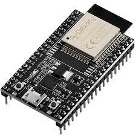

# ESP32 Dynamic DNS with MQTT and Bluetooth Keyboard

 [Português](README.pt.md) | English

- This project was created a few years ago, the original repository is private because it contains sensitive data, I am making the same code available without including sensitive data but with some changes and improvements (not yet tested)

This project uses an ESP32 to dynamically update DNS records on Cloudflare based on the device's public IP address. Additionally, the ESP32 can respond to MQTT commands and emulate a Bluetooth keyboard.


## ESP32 



## Features

- Connects to Wi-Fi to get the public IP address.
- Updates DNS records on Cloudflare when the public IP changes.
- Connects to MQTT to receive and respond to commands.
- Emulates a Bluetooth keyboard to send key presses to a computer or device.

## Components

- **ESP32**: Microcontroller to manage Wi-Fi connection, MQTT, Bluetooth, and Cloudflare.
- **Cloudflare**: Used to manage dynamic DNS records.
- **MQTT Broker**: Used for real-time communication with the ESP32.
- **Bluetooth**: Emulates a Bluetooth keyboard to send key inputs.

## Prerequisites

To compile and upload the code to your ESP32, you will need:

- **ESP32 Board**: Any ESP32-based model.
- **Arduino IDE**: Used to compile and upload the code to the ESP32.
- **Arduino Libraries**:
  - `WiFi.h` (for Wi-Fi connection)
  - `PubSubClient.h` (for MQTT)
  - `HTTPClient.h` (for HTTP requests)
  - `ArduinoJson.h` (for processing JSON)
  - `BleKeyboard.h` (for emulating a Bluetooth keyboard)

## Setup

### 1. Wi-Fi Configuration

In the code, define your Wi-Fi credentials:

```cpp
const char* ssid = "YOUR_SSID";  // Wi-Fi SSID
const char* password = "YOUR_PASSWORD"; // Wi-Fi Password
```

### 2. MQTT Configuration

Set up the MQTT server and the send/receive topics:

```cpp
const char* mqtt_server = "MQTT_SERVER_IP"; // MQTT Server
const char* topic_request = "esp32/request"; // Topic for received commands
const char* topic_response = "esp32/response"; // Topic for sent responses
```

### 3. Cloudflare Configuration

Create an API token on Cloudflare and get the Zone ID and record IDs for the DNS records you want to update:

```cpp
const char* token = "YOUR_TOKEN"; // Cloudflare API Token
const char* zone_id = "YOUR_ZONE_ID"; // Cloudflare Zone ID
const char* records[] = {"RECORD_ID_1", "RECORD_ID_2"}; // DNS record IDs
const int num_records = 2; // Number of DNS records to update
```

### 4. MQTT Connection

Ensure you have a working MQTT server and configure it to connect the ESP32.

### 5. Bluetooth

This code emulates a Bluetooth keyboard. Make sure the device is configured to receive key presses from the ESP32.

## How to Use

1. Compile and upload the code to the ESP32 using the Arduino IDE.
2. The ESP32 will automatically connect to the configured Wi-Fi network.
3. The ESP32 will check its public IP address, and if it changes, it will update the DNS records on Cloudflare.
4. The ESP32 will connect to the MQTT server and await commands.
5. Available MQTT commands:
    - **"IP"**: Returns the local IP of the ESP32.
    - **"REBOOT"**: Reboots the ESP32.

Additionally, the ESP32 will emulate a Bluetooth keyboard named "ESP32_Keyboard", allowing you to send key presses to other Bluetooth devices.

## Known Issues

- Cloudflare's API may have rate limits if you update DNS records too frequently.
- Wi-Fi connection may take a few seconds depending on your network.

## License

This project is licensed under the MIT License. See the [LICENSE](LICENSE) file for more details.

## Contributions

Contributions are welcome! If you find any bugs or want to add new features, feel free to open an issue or pull request.
